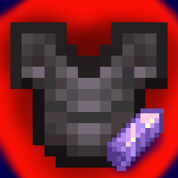

# TieredNeo

TieredNeo is a **NeoForge port** of the Tiered mod, inspired by Quality Tools. Every tool, weapon, or armor piece crafted, looted, or traded will receive a special modifier.



### Installation

TieredNeo is built for NeoForge 1.21.1. It requires [Cloth Config](https://modrinth.com/mod/cloth-config/version/15.0.140+neoforge).

## TL;DR
This mod focuses more on customization for modpacks, and its format is practically the same as its Fabric version.

### Customization

TieredNeo is entirely data-driven, meaning you can add, modify, and remove modifiers using datapacks. The base path for modifiers is `data/tieredneo/item_attributes`.

Here is an example modifier called "Hasteful," which grants increased digging speed when holding valid tools:

```json
{
  "id": "tieredneo:hasteful",
  "verifiers": [
    {
      "tag": "minecraft:pickaxes"
    },
    {
      "tag": "minecraft:shovels"
    },
    {
      "tag": "minecraft:axes"
    }
  ],
  "weight": 10,
  "style": {
    "color": "green"
  },
  "attributes": [
    {
      "type": "tieredneo:generic.dig_speed",
      "modifier": {
        "amount": 0.10,
        "operation": "ADD_MULTIPLIED_TOTAL"
      },
      "optional_equipment_slots": [
        "MAINHAND"
      ]
    }
  ]
}
```

### Attributes

TieredNeo provides 4 custom attributes.

- "tieredneo:generic.dig_speed" Increases the speed of block breaking.

- "tieredneo:generic.crit_chance" Offers a random percentage chance to deal a critical hit.

- "tieredneo:generic.durable" Increases or decreases the maximum durability of the item.

- "tieredneo:generic.range_attack_damage" Increases the base damage of fired projectiles (e.g., Arrows).

Standard Vanilla attributes are also fully supported (e.g., generic.armor, generic.attack_damage, generic.max_health, generic.luck, generic.movement_speed, etc.).

### Verifiers

A verifier, specified in the verifiers array of the JSON file, defines whether a given tag or specific item is eligible to receive the modifier.

A specific item ID can be targeted with:
```json
"id": "minecraft:apple"
```
A tag can be targeted with:
```json
"tag": "minecraft:head_armor"
```

### Weight
The weight determines the rarity of the tier. Higher weights increase the probability of the modifier being applied to an item.

### Tooltips
Custom tooltip borders can be applied via a resource pack.

1. The border texture must be located in `assets/tieredneo/textures/gui`.

2. The configuration file must be a JSON file located in `assets/tieredneo/tooltips`.

3. The `background_gradient` can be customized.

4. Gradients must be specified in hex code format (ARGB).

Example JSON for a tooltip border:
```json
{
  "tooltips": [
    {
      "index": 0,
      "start_border_gradient": "FFBABABA",
      "end_border_gradient": "FF565656",
      "background_gradient": "F0100010",
      "texture": "tiered_borders",
      "decider": [
        "tieredneo:common_armor",
        "common_melee_1"
      ]
    }
  ]
}
```
### Reforging

Items can be reforged to roll new tiers using the Reforge Screen, accessible via a tab in the Anvil interface.

The screen consists of three slots:

- Center Slot: The item to be reforged.

- Left Slot (Base Material): The repair material.
    - By default, this uses the **item's standard repair ingredient.** If none exists, items listed under the `tieredneo:reforge_base_item` tag are accepted.
    - You can override specific repair materials by creating a JSON file in `data/tieredneo/reforge_items`.

- Right Slot (Addition): The catalyst material required to execute the reforge. This slot only accepts items defined in the `tieredneo:reforge_addition` item tag.

To prevent specific items from ever receiving a tier or being reforged, add them to the `tieredneo:modifier_restricted` item tag.

Example of a custom reforge base JSON (data/tieredneo/reforge_items/bow.json):
```json
{
  "items": [
    "minecraft:bow"
  ],
  "base": [
    "minecraft:string"
  ]
}
```

### Commands
TieredNeo includes commands to manually apply or remove tiers from the item currently held in the main hand.

`/tiered tier <targets> <rarity>`: Applies a random tier of the specified rarity to the held item. Valid rarities are common, uncommon, rare, epic, legendary, and unique.

`/tiered untier <targets>`: Removes any existing tier modifier and resets the item's name to its vanilla state.

## FAQ
### Q: Will it be a 1:1 version of the Fabric version?
Yes and no. For now, it'll stay that way, but I plan to do my own thing while trying to keep it simple.
### Q: What are your plans?

Quality of life, features that help with gameplay, and a different format for the Datapacks
- I'm currently having a problem with my datapack, which contains **910 JSON** entries with duplicate values. I don't think this is correct, and I want to change the format.
- When doing a *“LET'S GO GAMBLING”* and looking for a better modifier, it's completely random. I want something that would prevent “worse” values but be flexible with any datapack (for example, a Terraria-style modifier format)
### Q: Do you have permission?
Yes!!! I talked to Globox on Discord.
### Q: What happens to StereoWalker?
**Context:** StereoWalker was the previous programmer responsible for porting the Globox mods to NeoForge.

Basically, StereoWalker has been missing for 8 months. I sent him an email on April 28, but as of this writing, I haven't received a reply.

### Q: Will you create a port for each Globox mod?
Yes and no, again.

I definitely plan to develop a port for the following mods:
- Rpgdifficulty
- LevelZ

The other mods aren't my priority... And also because I've never tried or played them in the first place, but maybe if I get enough support, I might end up learning them and creating a proper port.